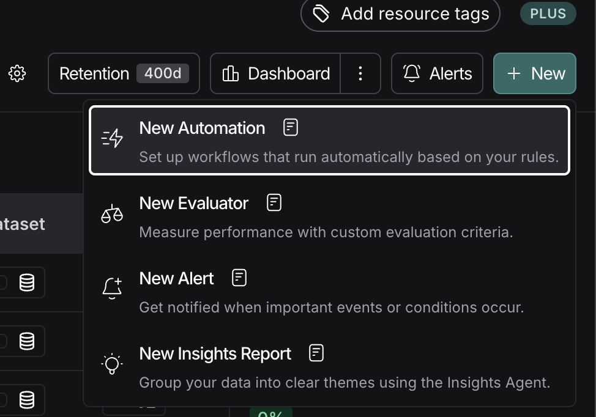
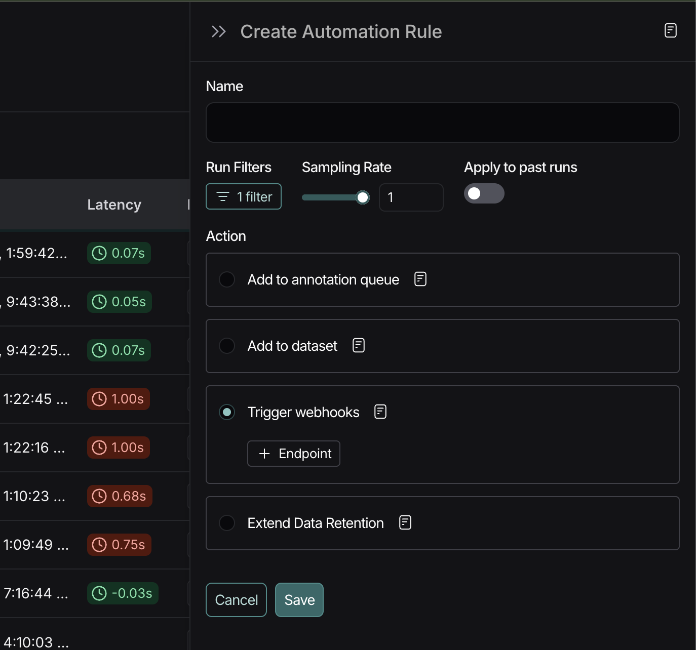
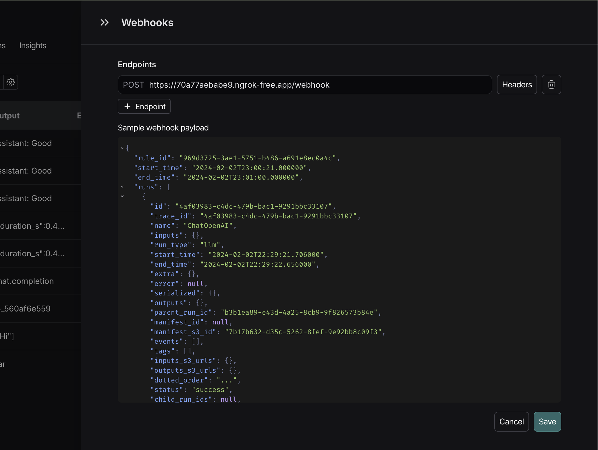
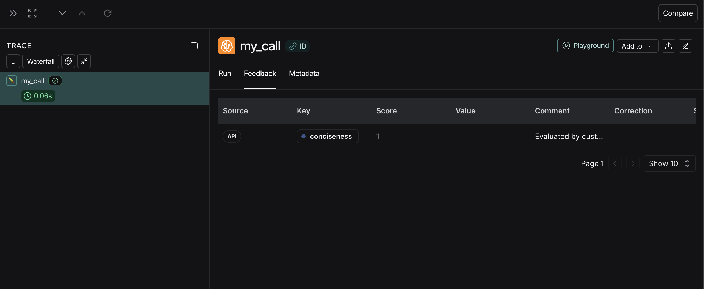

# langsmith-webhook-example

This repo contains an example of a LangSmith session webhook that pulls a previously saved prompt from the
[LangSmith prompt hub](https://smith.langchain.com/prompts), formats it with details from a payload,
calls an LLM, and finally scores the run by creating feedback based on the LLM response.
It does not use any external runtime dependencies other than `fastapi`, `openai`, `python-dotenv`, and `uvicorn`.

The pulled prompt is a [hardcoded public prompt](https://smith.langchain.com/prompts/simple-public-evaluator) in this example, but any prompt with an output schema will work.
The demo templating here expects the prompt to have variables named `{{inputs}}` and `{{outputs}}`, but you can customize this to your liking.

> [!NOTE]
> In general, we suggest using our [client SDKs](https://github.com/langchain-ai/langsmith-sdk) if possible, particularly for pulling/deserializing prompts - this minimal example is designed mostly as a proof of concept.

## Setup

Copy `.env.example` into a new file called `.env` and fill in your LangSmith API key and OpenAI API key.

Then run:

```bash
uv sync
```

## Start

To start the server:

```bash
uv run uvicorn server:app --reload
```

## Local testing (optional)

You can host this webhook using whatever setup you are most comfortable with, but you can use [ngrok](https://ngrok.com/) to expose your locally running server to LangSmith for testing:

```bash
ngrok http 8000
```

Then, go to https://smith.langchain.com, select a tracing project, and then press `+ New` in the top right.
Select `New Automation`:



And paste the tunnel URL as a LangSmith webhook:

`https://ASSIGNED_ID.ngrok-free.app/webhook`





Save, and this evaluator will run whenever a matching run comes in. Rules can take a minute or two to run.

You should see feedback matching the test evaluator once the evaluator runs:



## Further work

This is a minimal example - you can also create and associate evaluator runs for given feedbacks, use alternative models, and more.
